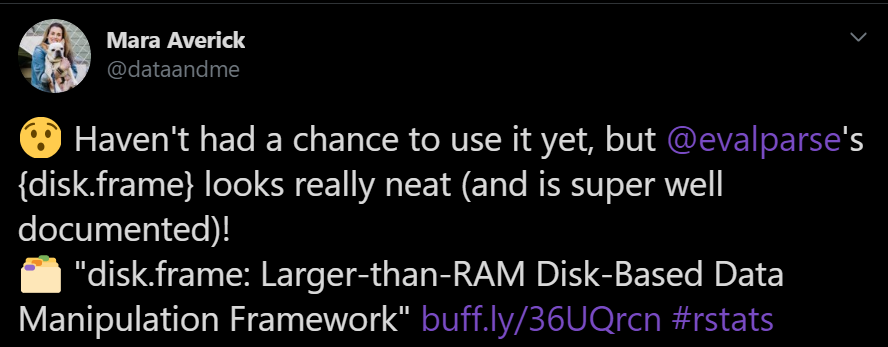
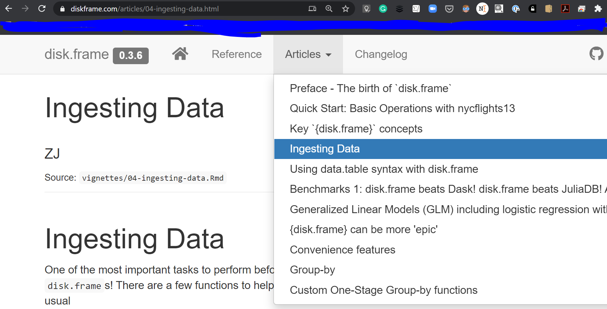

```{r setup, include=FALSE}
knitr::opts_chunk$set(echo = TRUE)
```

## Ingesting Data

Very important topic. `{disk.frame}` can handle large dataset on disk, but the data needs to be in `{disk.frame}` format. 


### Reading CSVs

`{disk.frame}` tries to be take advantage of multi-threading and multiple workers when possible.

The best way to read CSV is to use

```
csv_to_disk.frame("some/path.csv", outdir = "some.df")
```

For example, I will write a CSV and then read it back

```{r}
suppressPackageStartupMessages(library(disk.frame))
library(data.table)

# Write a file
data.table::fwrite(nycflights13::flights, "tmp.csv")
```

reading ONE CSV

```{r}
flights.df <- csv_to_disk.frame("tmp.csv", "some_location.df")
flights.df
```

```{r}
head(flights.df)
```
### {disk.frame} read CSV logic

{disk.frame} has multiple CSV backends: {data.table}, {readr}, {LaF}, {bigreader} . It uses some rather complicated logic to determine which backend to use. In general, it prefers data.table and roughly follows this logic

* If {disk.frame} deems your CSV to be small enough to fit in RAM it will use data.table's `fread`
* If the file is too large, it will use {bigreadr} to SPLIT the file into smaller files and then read the smaller files simultaneously. In practice this was found to be the fastest approach.

How to invoke the different back-ends?

```
?csv_to_disk.frame
```

I try to make documentation as good as possible. See



For more details, please refer to [the "Ingesting Data" article on the diskframe.com website](https://diskframe.com/articles/04-ingesting-data.html)



### Reading multiple CSVs with the same columns

```{r}
# write two CSV files
data.table::fwrite(nycflights13::flights, "tmp1.csv")
data.table::fwrite(nycflights13::flights, "tmp2.csv")

flights_doubled.df <- csv_to_disk.frame(c("tmp1.csv", "tmp2.csv"), "some_location.df")
flights_doubled.df
```

**Discussion: What are some dangers to watch out for when reading multiple CSVs?**


### Ingesting other data types?

The one function I would recommend using is `add_chunk`. It adds a file chunk to a `disk.frame`. Example use-cases include:

1. New data comes in on a regular basis (e.g. month), `add_chunk(exisint_disk.frame, new_chunk.data.frame)`
2. Reading from a database chunk by chunk and convert it to `disk.frame` format

Because the `disk.frame` is nothing but `fst` files in a folder. You can be creative and create the `fst` files `1.fst`, `2.fst`, `3.fst` simultaneously.


#### "Stream" data for a DBMS chunk-by-chunk
I will show an SQLite example. Other DBMS follows the same tricks

```{r}
library(RSQLite)

library(DBI)
# Create an ephemeral in-memory RSQLite database
con <- dbConnect(RSQLite::SQLite(), ":memory:")
dbWriteTable(con, "flights", nycflights13::flights)

res <- dbSendQuery(con, "SELECT * FROM flights LIMIT 100 OFFSET 0")
dbFetch(res)
```

```{r}
db_to_disk.frame <- function(con, tbl, ..., chunksize = 1e6) {
  suppressWarnings(
    row_count <- DBI::dbSendQuery(con, glue::glue("SELECT count(*) from {tbl}")) %>% DBI::dbFetch()
  )
  row_count = row_count[[1]]
  
  offsets = seq.int(0, max(0, row_count-chunksize+1), length.out=ceiling(row_count/chunksize))
  offsets = as.integer(ceiling(offsets)) %>% unique
  
  suppressWarnings(
    res <- dbSendQuery(con, glue::glue("SELECT * FROM {tbl} LIMIT {as.integer(chunksize)} OFFSET 0"))
  )
  
  suppressWarnings(res <- dbFetch(res))
  
  df_out = as.disk.frame(res, ...)
  
  purrr::walk(offsets[-1], function(offset) {
    suppressWarnings(
      res <- dbSendQuery(con, glue::glue("SELECT * FROM {tbl} LIMIT {as.integer(chunksize)} OFFSET 0"))
    )
    add_chunk(df_out, res %>% dbFetch())
  })
  
  df_out
}

flight_from_sqlite.df = db_to_disk.frame(con, "flights", chunksize = 50000)
flight_from_sqlite.df
```
```{r}
head(flight_from_sqlite.df)
```

But why stream to {disk.frame} when you already have a DBMS? Good question.

In many case you don't have to! In fact, I recommend using a DBMS if you are lucky to have one set up at work.

However, I am just showing the general technique of using `add_chunk` and how you can be creative. Also, having data in `disk.frame` means that now you have **almost** the entire R ecosystem of function open to you.


