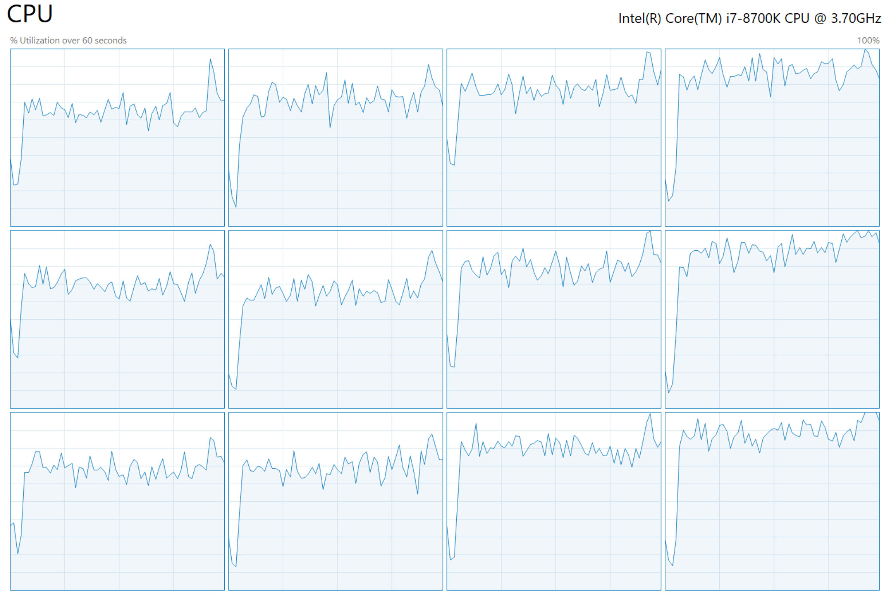
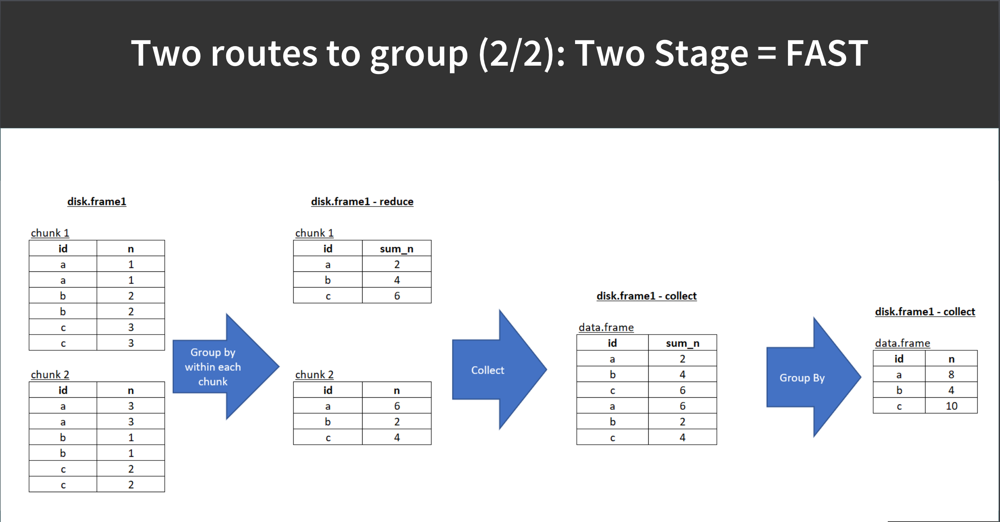
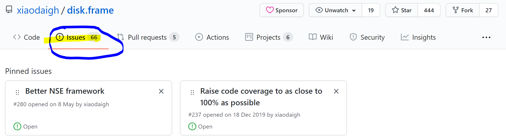

```{r setup, include=FALSE}
knitr::opts_chunk$set(echo = TRUE)
```

We have shown how `{disk.frame}` works really well with `{dplyr}` verbs and a few ways to convert data into the `disk.frame` format.

We will show how to actually use `{disk.frame}`!

## Group-by

Performing group-by on large datasets is key use-case for `{disk.frame}`.


You will not be able to run on your computer as the data sits on mine. It's from the Fannie Mae dataset. I have concatenated all the Performance data into one 1.8 billion row dataset
```{r}
library(disk.frame)
setup_disk.frame()

fannie_mae.df = disk.frame("c:/data/fannie_mae_disk_frame/fm.df/")
fannie_mae.df
```
It's got 1.8 billion rows.

```{r}
head(fannie_mae.df)
```
Let's compute the average `delq.status` grouped by `monthly.rpt.prd`. This takes about less than 1s, this is because the computation is _lazy_. 

```{r}
system.time(
  grp.df <- fannie_mae.df %>% 
    srckeep(c("last_rt", "monthly.rpt.prd", "loan.age")) %>% 
    group_by(monthly.rpt.prd) %>% 
    summarize(
      avg_last_rt = mean(last_rt, na.rm=TRUE), 
      median_loan.age = median(loan.age)
      )  
)
```
Computation only happens when you call `collect`. This should take about 1~2 mins

```{r, cache=TRUE}
system.time(
  grp.df <- collect(grp.df)
)
grp.df
```




**IMPORTANT!**

```r
grp.df <- fannie_mae.df %>% 
    srckeep(c("last_rt", "monthly.rpt.prd", "loan.age")) %>%  # important!
```

Remember to use `srckeep` so that only the columns needed are loaded into memory.

How is `srckeep` different from `select`? Select will load all columns into memory from disk, and then filter the columns, whereas `srckeep` will only load the selected columns into memory and is therefore more memory efficient and MUCH faster.

Future work: have `{disk.frame}` detect what columns are used and then call `srckeep` implicitly, so we don't have to do it manually.


### Group-by continued

So you can perform a group-by using these `summarize` functions. I will briefly discuss how to add more, if time allows. 

Notice, how `median` and any rank-based summarization are `estimates` instead of exact computations. This is the same in other distributed systems like Spark, because it's inherently computationally too expensive to compute the _exact_ number (due to the chunked nature of data storage).


| Function     | Exact/Estimate | Notes                                      |
|--------------|----------------|--------------------------------------------|
| `min`        | Exact          |                                            |
| `max`        | Exact          |                                            |
| `mean`       | Exact          |                                            |
| `sum`        | Exact          |                                            |
| `length`     | Exact          |                                            |
| `n`          | Exact          |                                            |
| `n_distinct` | Exact          |                                            |
| `sd`         | Exact          |                                            |
| `var`        | Exact          | `var(x)` only `cor, cov` support *planned* |
| `any`        | Exact          |                                            |
| `all`        | Exact          |                                            |
| `median`     | Estimate       |                                            |
| `quantile`   | Estimate       | One quantile only                          |
| `IQR`        | Estimate       |                                            |


`{disk.frame}` takes care of boring details for you and you use 




### Limitations of group by

```{r}
flight.df <- as.disk.frame(nycflights13::flights)

head(flight.df)
```

**Nesting of summarization is not allowed (yet)**

For example, do not run the below or it will error or hang your session (on the road map to be fixed)

```r
flight.df %>% 
  group_by(year, month) %>% 
  summarize(
    mean(dep_delay/max(arr_delay, na.rm=TRUE), na.rm = TRUE)
    ) %>% 
  collect
```

## How to use `cmap/delayed`

What is the `dplyr` verbs do not satisfy my needs? That's where `cmap/delayed` come in.

You can apply arbitrary functions. The `c` in `cmap` stands for _chunk_. The basic syntax is

```r
lazy.result <- a.disk.frame %>% 
  cmap(fn)
```

Which will apply the function `fn` to each chunk of `a.disk.frame`.

```{r}
lazy.result <- flight.df %>% 
  cmap(function(chunk) {
    ncol(chunk)*nrow(chunk)
  })

lazy.result
```

By default `cmap` is lazy, so it doesn't return the results until `collect` is called

```{r}
non_lazy.result <- flight.df %>% 
  cmap(function(chunk) {
    ncol(chunk)*nrow(chunk)
  }, lazy=FALSE) 

non_lazy.result
```
It the return value of `cmap` is a data.frame, it automatically row concanate it, and if it's not a data.frame then it returns list.

If you use `collect` you must return a data.frame from the inner function but you can also call `collect_list` to remove that restriction.

```{r}
collect_list.result <- flight.df %>% 
  cmap(function(chunk) {
    ncol(chunk)*nrow(chunk)
  }) %>% 
  collect_list

collect_list.result
```

```{r}
collect.result <- flight.df %>% 
  cmap(function(chunk) {
    # remember for collect you must return a dataset
    data.frame(ncells = ncol(chunk)*nrow(chunk)) 
  }) %>% 
  collect

collect.result
```
If you are familiar with `{purrr}` then `disk.frame::cimap` and `disk.frame::cmap_dfr` are the equivalent of `purrr:imap` and `purrr::map_dfr`.

## Performing data manipulation/pipeline on disk

The above examples shows how to perform data manipulation and then bring the results into memory.

Often, we want to take a `disk.frame`, apply some transformation on it and store it as another `disk.frame`.

You can do that with `cmap` and `write_disk.frame`. E.g.

```{r}
library(purrr)
flights_w_flight_date.df <- flight.df %>% 
  cmap(function(chunk) {
    chunk %>% 
      mutate(flight_date = as.Date(paste(year, month, day, sep = "/")))
  }, outdir = "flights_w_flight_date.df", lazy = FALSE, overwrite=TRUE)


flights_w_flight_date.df
```
```{r}
head(flights_w_flight_date.df)
```
If you just do `dplyr` verbs and want to write it out

```{r}
flights_w_flight_date.dplyr.cmap.df <- flight.df %>% 
  cmap(~{
    # .x is a chunk
    glm_model = glm(dep_delay~arr_delay, data = .x)
    broom::tidy(glm_model)
  }) %>% 
  rename(p_value = p.value, std_error = std.error)
  
flights_w_flight_date.dplyr.cmap.df
```
  
```{r}
flights_w_flight_date.dplyr.cmap.df %>% 
  collect
```

```{r}
flights_w_flight_date.df %>% 
  write_disk.frame(outdir = "some_model.df", overwrite = TRUE)
```

You can simply save the lazy `disk.frame` and re-use.

```{r}
flights_w_flight_date.lazy.df <- flight.df %>% 
  mutate(flight_date = as.Date(paste(year, month, day, sep = "/")))

flights_w_flight_date.lazy.df

saveRDS(flights_w_flight_date.lazy.df, "flights_w_flight_date.lazy.df.file")

loaded_flights_w_flight_date.lazy.df = readRDS("flights_w_flight_date.lazy.df.file")

head(loaded_flights_w_flight_date.lazy.df)
```
Also works with `{qs}`

```{r}
flights_w_flight_date.lazy.df <- flight.df %>% 
  mutate(flight_date = as.Date(paste(year, month, day, sep = "/")))

flights_w_flight_date.lazy.df

qs::qsave(flights_w_flight_date.lazy.df, "flights_w_flight_date.lazy.df.qs")

loaded_flights_w_flight_date.lazy.df = qs::qread("flights_w_flight_date.lazy.df.qs")

head(loaded_flights_w_flight_date.lazy.df)
```

**Note**, if you use a global variable when saving a lazy `disk.frame`, `{disk.frame}` can remember the global for you. But you shouldn't really refer to large global variables in your code.

```{r}
x = 100
flights_w_flight_date.lazy.df <-  flight.df %>% 
  mutate(dep_time = dep_time + x)

flights_w_flight_date.lazy.df %>% get_chunk(1)

saveRDS(flights_w_flight_date.lazy.df, "added100.df.rds")

rm(x)
loaded_flights_w_flight_date.lazy.df = readRDS("added100.df.rds")

loaded_flights_w_flight_date.lazy.df %>% get_chunk(1)
```
## Summary

We have seen how to do `group-by`

How to use `cmap` to run arbitrary functions over chunks in _parallel_.

How `{disk.frame}` is _lazy_ by default (mostly, some joins are _eager_ by default). 

How to use `cmap(..., lazy=FALSE, outdir)` and `write_disk.frame(disf, outdir)` to save a new `disk.frame`

How to save a `lazy` `{disk.frame}` for and load it for re-use 

## Do we still have time?

Want to leave 20 mins for Q&A.

If we still have time we go through, 
* [data.table syntax](https://diskframe.com/articles/05-data-table-syntax.html)
* [running logistic regression using `{disk.frame}`](https://diskframe.com/articles/07-glm.html)
* [some convenience features ](https://diskframe.com/articles/09-convenience-features.html)
* [how to define your own one-stage group-by functions](https://diskframe.com/articles/11-custom-group-by.html)


## Learn more about {disk.frame}?

Go to diskframe.com

Feel free (I really mean it) to ask question on Github.com https://github.com/xiaodaigh/disk.frame

Just submit an issue



## Future plans

1. Bugfixes
1. A better NSE system
1. Raise testing code coverage to 100%
1. Comprehensive documentation
1. New features
